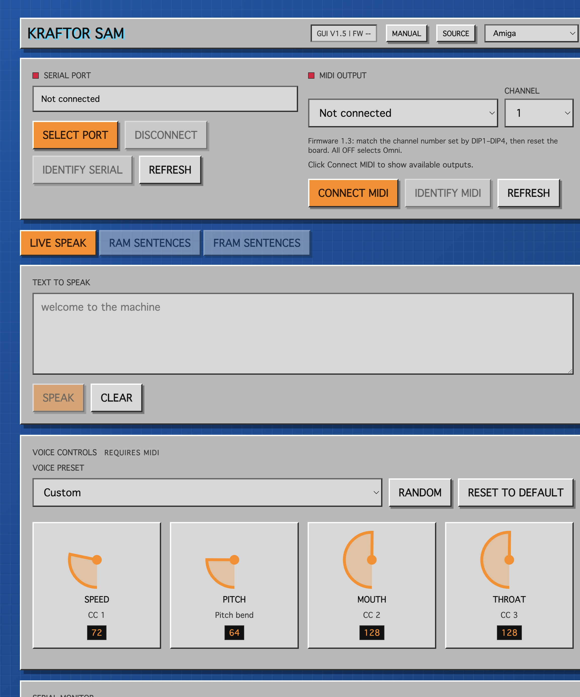

# Kraftor SAM Designer

Browser control surface for the Kraftor SAM firmware. GUI version 1.4 provides live text-to-speech control, MIDI voice shaping, RAM and FRAM sentence-bank editing, printable reference sheets, and a few retro interface skins.

[Open the published app](https://deladriere.github.io/SAM_Designer/)

## Features

- Speak typed text over USB Serial at 115200 baud.
- Display the connected board model and unique chip ID with firmware 1.2 or newer.
- Identify serial and MIDI connections when several Kraftor boards are connected.
- Shape the SAM voice with Speed, Pitch, Mouth, and Throat controls.
- Send MIDI CC and pitch-bend messages to the firmware.
- Edit RAM sentence slots and FRAM sentence slots when supported by the board.
- Bulk-fill sentence banks from pasted text.
- Print RAM/FRAM MIDI reference sheets.
- Switch between Amiga, HAL 9000, WOPR, Moon 1999, and Alien skins.

## Requirements

- A browser with Web Serial and Web MIDI support, such as Chrome or Edge.
- A Kraftor SAM board running compatible firmware.
- USB connection from the board to the computer.

## Usage

Open `index.html` in a supported browser.

For serial speech:

1. Click `Select port`.
2. Choose the Kraftor USB serial device.
3. Confirm the board model and chip ID shown by the app.
4. Click `Identify Serial` to make that board speak "serial connection".
5. Type text in the live speech field.
6. Click `Speak`.

For MIDI voice control:

1. Click `Connect MIDI`.
2. Allow MIDI access if prompted.
3. Select the MIDI output.
4. Click `Identify MIDI`. The app writes "meedee connection" into temporary RAM
   slot 0 through the selected serial connection, then sends MIDI note 28.
5. Confirm that the expected board speaks.
6. Move the voice controls or choose a preset.

When multiple boards expose the same MIDI name, the selector adds a compact Web MIDI ID
to each duplicate name. Chrome does not expose a guaranteed relationship between a Web
Serial port and a Web MIDI endpoint, so `Identify Serial` and `Identify MIDI` provide a
practical way to match them.

## Firmware Compatibility

- Firmware 1.2 or newer reports `MODEL=SAM` and the unique SAMD21 chip ID. The app
  displays both after connecting over serial.
- Firmware 1.1 remains compatible with speech, sentence banks, MIDI controls, and both
  identification buttons, but the serial connection label cannot show its model or chip ID.

## Manual

The included [user manual](user_manual.html) has setup details, MIDI mappings, RAM/FRAM behavior, and firmware command notes.

## Project Structure

- `index.html` - Main Kraftor SAM Designer interface.
- `user_manual.html` - Browser-readable user manual.
- `assets/screenshot.png` - Screenshot used by this README.
